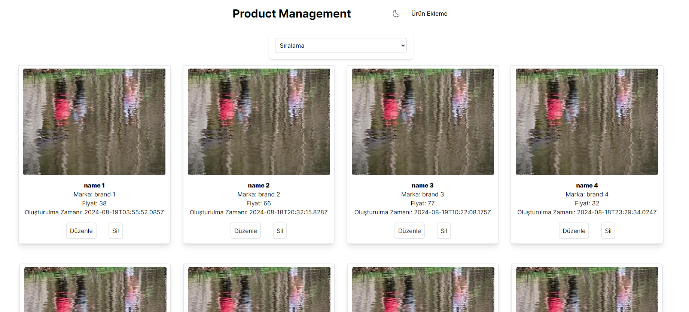
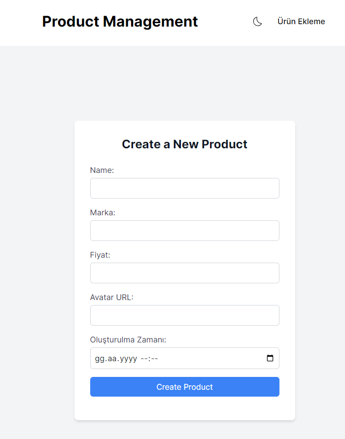

Project Name: Product Management Sample Application
 Objective: Development of a product management panel used in a web-based e-commerce site. This panel will be able to add, update and delete products with sample data. Preferably you can obtain sample data via a third party API.
  
Technologies to be used: HTML, CSS, JavaScript, TypeScript, React, Next.js, SASS/LESS, Git 

Main Features: - Product Listing - Product Add (Form for adding a new product. The data model about the product can be extended; that is, additional information such as brand, model, color can be added.) - Product Update - Product Delete - Mobile Compatible Design 

Optional Features: - Server-side rendering application with Next.js. - Sorting Feature (Sorting products by price, popularity or date added.) - Multi-Language Support - Dark Mode 

Evaluation Criteria: - Cleanliness and organization of code structure - Design principles and user experience - Effective and correct use of technologies - Successful integration of optional features

  

## Deploy on Vercel

The easiest way to deploy your Next.js app is to use the [Vercel Platform](https://vercel.com/new?utm_medium=default-template&filter=next.js&utm_source=create-next-app&utm_campaign=create-next-app-readme) from the creators of Next.js.

Check out our [Next.js deployment documentation](https://nextjs.org/docs/deployment) for more details.
